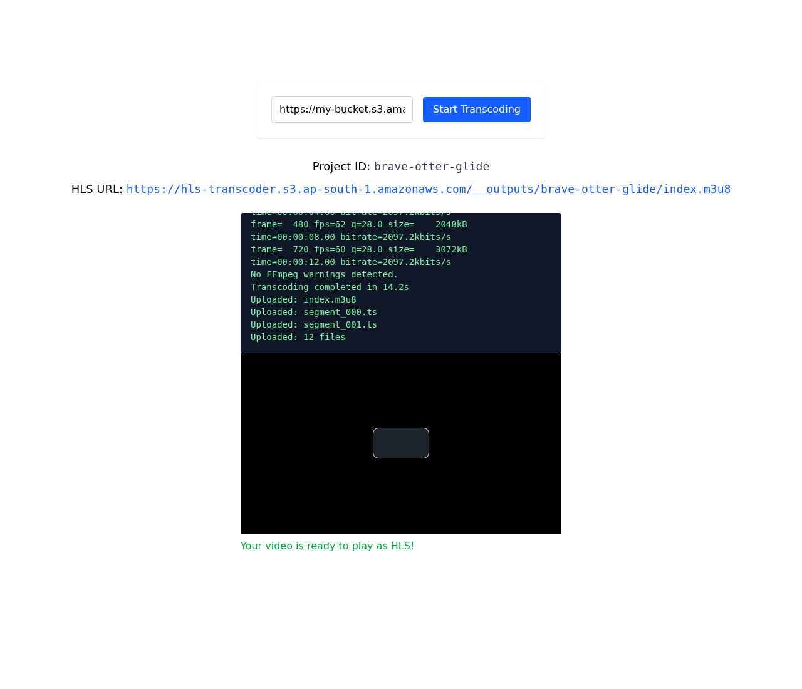

# HLS Transcoder

Distributed video transcoding pipeline that converts videos hosted on S3 into HLS (HTTP Live Streaming) playlists using FFmpeg in Docker, with real-time FFmpeg log streaming over WebSocket.

> **Read the deep-dive:** [HLS adaptive bitrate streaming with FFmpeg and Node.js](https://srb.codes/blog/hls-video-transcoder-nodejs)



## How it works

```
Browser → API Server → Redis (queue + pub/sub) → Transcoder Worker (Docker) → S3
              ↕ Socket.IO (live ffmpeg log stream)
```

1. The user pastes the **S3 URL of an already-uploaded source video** into the UI and clicks *Start Transcoding*.
2. The API server records the job in SQLite, generates a project slug, and spawns a one-shot `transcoder` Docker container with the input URL and project ID.
3. The transcoder pulls the video from S3, runs FFmpeg (`libx264` + `aac` → HLS, 10-second `.ts` segments), and uploads the resulting `index.m3u8` and `.ts` segments back to S3 under `__outputs/{projectId}/`.
4. Live FFmpeg progress is published to `logs:{projectId}` on Redis; the API server forwards those messages to the browser over Socket.IO.
5. When the upload finishes, the transcoder publishes the final `.m3u8` URL on the same channel and the UI plays it back inline via video.js.

## Components

- `api-server/` — Node.js + Express. REST endpoint `POST /transcode`, Socket.IO log relay, SQLite job table.
- `transcoder/` — Node.js + FFmpeg. One container per job. Pulls source from S3, transcodes, uploads HLS output, publishes logs.
- `frontend/` — React + Vite + video.js. Form → live log stream → HLS playback.
- `redis` — Job queue and Socket.IO pub/sub channel.

## Tech stack

| Layer | Tech |
|---|---|
| API | Node.js, Express, Socket.IO |
| Transcoding | FFmpeg (libx264 + AAC → HLS) |
| Pub/sub | Redis |
| Object storage | AWS S3 |
| Frontend | React, Vite, video.js, TailwindCSS |
| Orchestration | Docker, docker-compose |

## System design


## Quick start

> Heads up: this is **not** zero-config. The pipeline writes to S3, so you need an AWS account, an S3 bucket, and IAM credentials with `PutObject`/`GetObject` on that bucket. Plan ~10 minutes including AWS setup.

### Prerequisites

- Docker + docker-compose (Docker Desktop on macOS/Windows is fine)
- An AWS S3 bucket. The transcoder writes HLS output under `__outputs/{projectId}/`. The bucket must allow public reads if you want the browser to play the result directly (or front it with CloudFront).
- An IAM user with `s3:PutObject`, `s3:GetObject` (and `s3:ListBucket` for safety) scoped to that bucket.
- A source video already uploaded to an S3 URL the IAM user can read.

### Run

1. Copy the env templates and fill in your AWS values:

   ```bash
   cp api-server/.env.example api-server/.env
   cp transcoder/.env.example transcoder/.env
   # edit api-server/.env — set AWS_REGION, S3_BUCKET, AWS_ACCESS_KEY_ID, AWS_SECRET_ACCESS_KEY
   ```

2. Build the per-job transcoder image (the API server spawns this image dynamically per transcoding job):

   ```bash
   docker compose --profile build-only build transcoder
   ```

3. Start the API server, Redis, and the frontend dev server:

   ```bash
   docker compose up --build
   ```

4. Open <http://localhost:5173>, paste an S3 URL to a `.mp4` (or any FFmpeg-readable input), and click **Start Transcoding**. You should see live FFmpeg progress and the `.m3u8` URL play back when it finishes.

### Ports

| Service | Port |
|---|---|
| Frontend (Vite dev) | 5173 |
| API REST (`/transcode`, `/projects`) | 9000 |
| Socket.IO (live logs) | 9001 |
| Redis | 6379 |

### Local dev (without docker-compose)

Each service runs standalone:

```bash
# Redis
docker run --rm -p 6379:6379 redis:7-alpine

# API server
cd api-server && npm install && npm run dev

# Transcoder image (one-shot per job; api-server spawns it)
docker build -t transcoder ./transcoder

# Frontend
cd frontend && npm install && npm run dev
```

## Configuration

All AWS, Redis, and image settings are env-driven. See `api-server/.env.example` and `transcoder/.env.example` for the full list. Notable variables:

| Variable | Used by | Purpose |
|---|---|---|
| `REDIS_URL` | api-server, transcoder | Pub/sub channel for FFmpeg logs |
| `AWS_REGION`, `S3_BUCKET` | api-server, transcoder | Output bucket the HLS playlist is written to |
| `AWS_ACCESS_KEY_ID`, `AWS_SECRET_ACCESS_KEY` | api-server, transcoder | IAM creds (passed through to the spawned transcoder) |
| `TRANSCODER_IMAGE` | api-server | Docker image tag the api-server runs per job (default `transcoder`) |
| `TRANSCODER_NETWORK` | api-server | Docker network the transcoder joins; in compose set this to `hls-transcoder_hls` so the worker can reach Redis by name |

## Project layout

```
hls-transcoder/
├── api-server/       # Express + Socket.IO + SQLite
│   ├── src/index.js
│   └── .env.example
├── transcoder/       # FFmpeg + S3 uploader (one-shot per job)
│   ├── src/{index,transcoder,s3,logger}.js
│   └── .env.example
├── frontend/         # React/Vite UI
└── docker-compose.yml
```

## Caveats

- The api-server spawns the transcoder via `docker run` against the host Docker daemon, so the container needs the host docker socket mounted (`/var/run/docker.sock`). That gives the api-server root-equivalent access on the host — fine for self-hosting, **not** safe for multi-tenant deployments without sandboxing the worker.
- Source videos must already live on S3. There is no upload endpoint in this server — wire up presigned uploads or your own ingest path if you need direct browser uploads.
- HLS output is VOD (`-hls_playlist_type vod`), single-bitrate. Adaptive-bitrate ladders are a straightforward extension — open an issue if you'd like that landed.

## Author

Built by [Sourabh Soni](https://srb.codes?utm_source=github&utm_medium=readme&utm_campaign=hls-transcoder) — Full-Stack & Gen AI Engineer.

Walkthrough on the blog: [HLS adaptive bitrate streaming with FFmpeg and Node.js](https://srb.codes/blog/hls-video-transcoder-nodejs?utm_source=github&utm_medium=readme&utm_campaign=hls-transcoder).

## License

[MIT](LICENSE)
