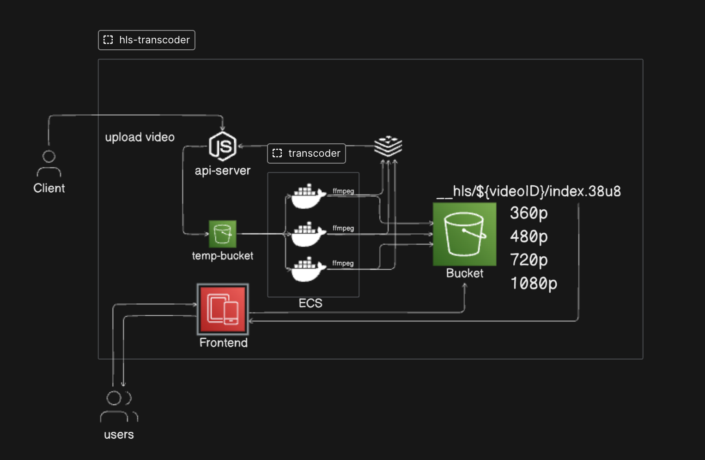

# HLS Transcoder System

This project is a simple HLS (HTTP Live Streaming) transcoder system. It consists of multiple components working together to transcode and serve video streams efficiently.

## System Design

Below is the system design diagram for the HLS transcoder system:

## Project Structure

- `api-server/` - Handles API requests.
- `frontend/` - User interface for interacting with the system.
- `transcoder/` - Handles video transcoding tasks.

---

Feel free to explore each directory for more details about individual components.

## Author

Built by [Sourabh Soni](https://srb.codes?utm_source=github&utm_medium=readme&utm_campaign=hls-transcoder) — Full-Stack & Gen AI Engineer.

> No case-study post exists yet. Content calendar target: **"HLS adaptive bitrate streaming with FFmpeg and Node.js"** (keyword: `hls adaptive bitrate streaming nodejs ffmpeg`).
